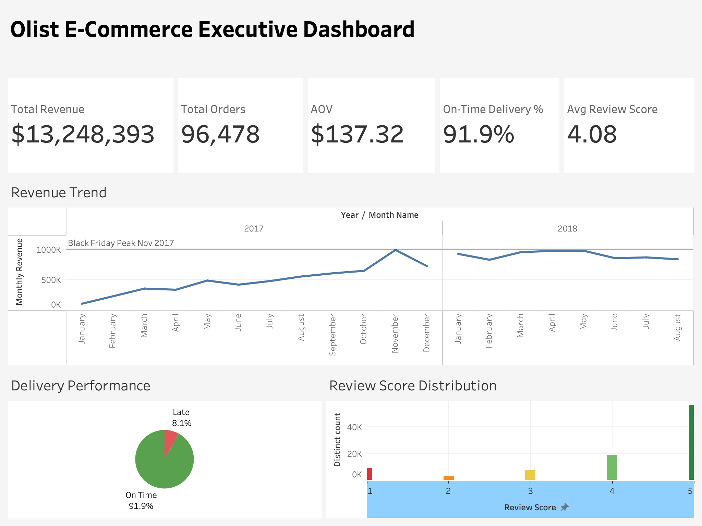
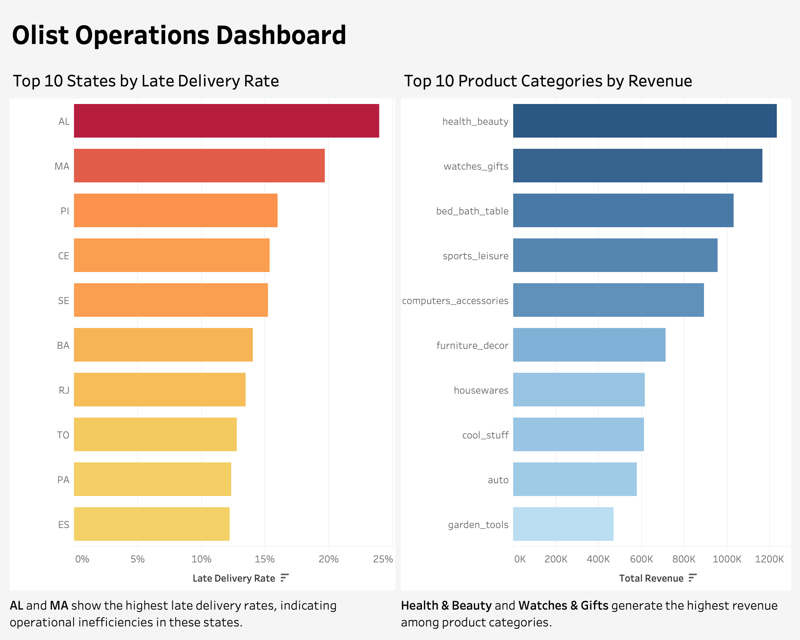
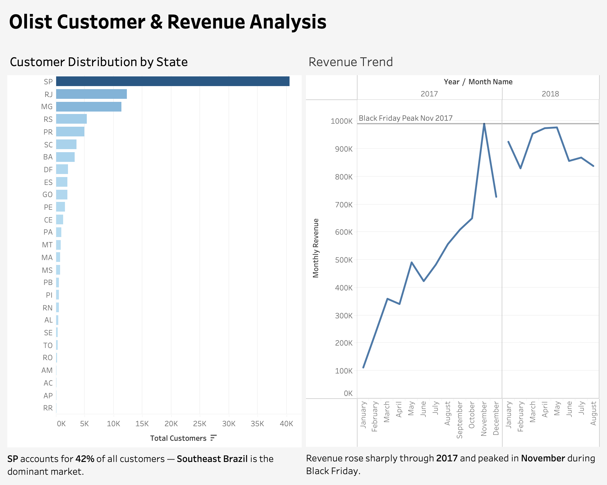

# Olist E-Commerce Dashboard Project

This project analyzes the Olist Brazilian E-Commerce dataset using MySQL and Tableau.  
The goal was to load raw CSV files into SQL, validate and analyze the data, and build interactive dashboards for business insights.

## Tools Used
- MySQL
- SQL
- Tableau
- Kaggle Olist Dataset
- GitHub

## Project Workflow
1. Downloaded the Olist dataset from Kaggle
2. Loaded 9 CSV files into MySQL
3. Performed data validation and SQL analysis
4. Built KPI metrics and dashboards in Tableau
5. Exported dashboards as high-quality PNGs
6. Documented the project on GitHub

## Repository Structure

olist-ecommerce-analysis/
│
├── data/                   # Raw CSV files (not uploaded - too large)
├── sql/
│   └── olist_analysis.sql  # All SQL: cleaning, EDA, modeling, KPIs
├── dashboard/
│   ├── Olist_Dashboard.twbx
│   ├── Olist_Dashboard.pdf
│   └── Olist_Dashboard.pptx
└── README.md

## Dashboard 1: Executive Overview
Shows key business KPIs such as total revenue, total orders, AOV, on-time delivery percentage, and average review score.

## Dashboard 2: Customer & Revenue Analysis
Highlights customer distribution by state and monthly revenue trend, including the Black Friday peak in November 2017.

## Dashboard 3: Operations Dashboard
Focuses on late delivery rate by state and top product categories by revenue to identify operational and category-level performance patterns.

## Key Insights
- Total revenue exceeded 13.2M across the dataset period.
- Sao Paulo contributed the highest share of customers.
- Revenue peaked during Black Friday in November 2017.
- On-time delivery rate was high overall, but some states had noticeably higher delay rates.
- Health & Beauty and Watches & Gifts were among the top revenue-generating categories.

## Dataset
Source: [Olist Brazilian E-Commerce Public Dataset](https://www.kaggle.com/datasets/olistbr/brazilian-ecommerce)

The dataset contains information on customers, orders, payments, products, reviews, sellers, and geolocation.
